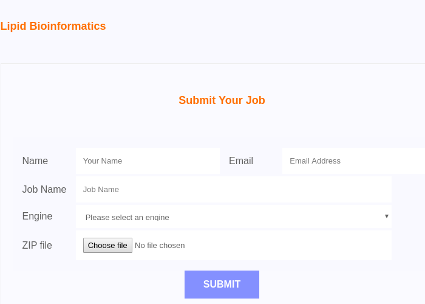

# Functional mapping


### How to prepare your data?

Before you submit your job to the `Leri` web-server, please make your data ready to upload. Each ZIP or TAR.GZ data includes a library that consists of sequencing results from the enzymes DpnII and NlaIII.  

Generally, one get four FASTQ files for each enzyme from the sequencing machine, i.e. Illumina. Eight FASTQ can be obtained for each library, and put them in the same folder, just zip it on Unix-like OS as follows, 

```text
zip -r <output>.zip <input_folder>
```

There are two levels in the &lt;input\_folder&gt;, the first \(top\) one includes all the secondary folder consists of all the sequencing data folders. In each data folder, there is one FASTQ \(.gz\) file. The tree structure of the &lt;input\_folder&gt; is listed as follows,

```text
.
├── NlaIII_1/
|   └── *.fastq.gz
├── NlaIII_2/
|   └── *.fastq.gz
├── NlaIII_3/
|   └── *.fastq.gz
├── NlaIII_4/
|   └── *.fastq.gz
├── DpnII_1/
|   └── *.fastq.gz
├── DpnII_2/
|   └── *.fastq.gz
├── DpnII_3/
|   └── *.fastq.gz
└── DpnII_4/
    └── *.fastq.gz
```


Currently, it only supports that the name of folders for all NlaIII MUST include even number at the beginning while it is odd number for all the DpnII.


### Ready to submit a job?

When your data is ready to upload to `leri` web-server, just do it here as follows,



As illustrated above, the email address, engine \(that you would like to use\) and the ZIP file \(that you already compress the sequencing data\) are required, and the remain are optional. The optional items can be blank, but you cannot successfully submit the job if you leave the required items blank. Please complete the form according to the error\(s\) and/or warning\(s\) when you submit your job, then you can make it. 

For the sequencing data from the SATAY protocol, one can visualize it using [UCSC genome browser](https://genome.ucsc.edu/) after the job is completed. You can also download them for your specific needs.

