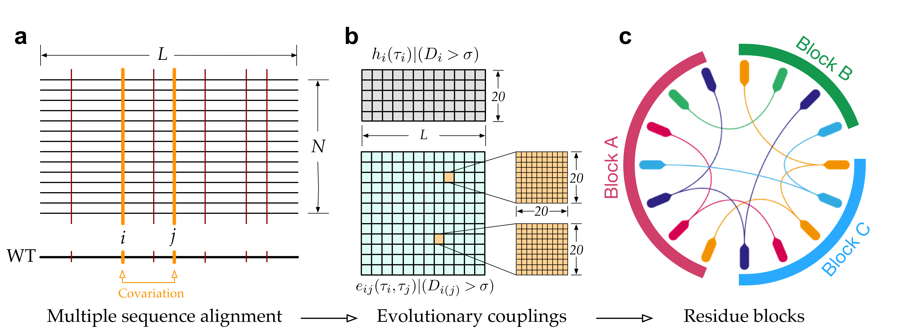

# Evolutionary couplings of amino acids

In evolutionary coupling analysis \(ECA\) approach, we focus on the detections of coupling amino acids at conserved positions using a relative entropy as shown in Eq. \(1\) to filter interactions at weak- or non-conservation sites. The specified network of interactions between amino acids, as illustrated in Figure 2, estimated from sequence alignment can be a trade-off between consensus and couplings, which also tests our understanding of that proteins have evolved for function but not stability.

