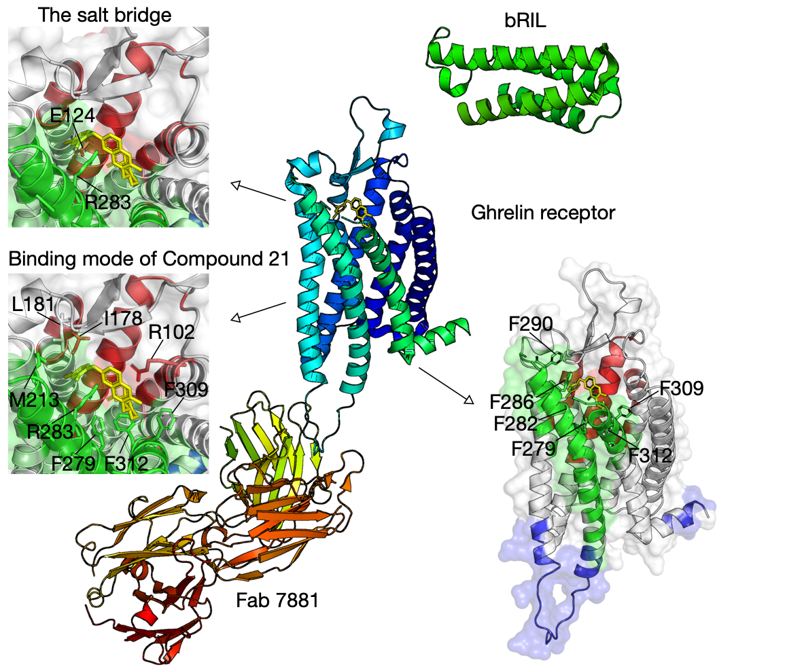

# Inferring functional networks

The SAEC approach successfully identified functional communities that cover the ligand-binding pocket of the ghrelin receptor \(hGHSR PDB: 6KO5\).

#### References

* Shiimura, Yuki, et al. "Structure of an antagonist-bound ghrelin receptor reveals possible ghrelin recognition mode." Nature Communications 11.1 \(2020\): 1-9.

