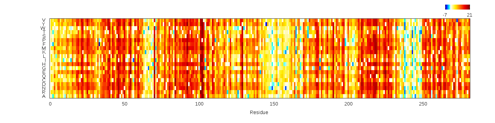
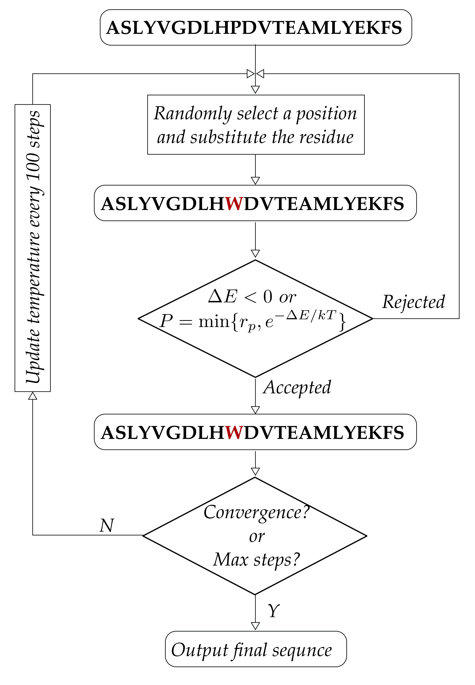

# Protein design

## Single mutation

Leri provides a tool, shown as following command, for the computer-aided design of mutant proteins with controlled evolutionary information. It evaluates the changes at signle site in stability of a protein without referring to its tertiary structure. Figure 1 illustrates energy changes \( $${\Delta}E=E_{mut}-E_{wt}$$\) between wild type and mutant sequences when a single mutation occurs to the wild type sequence of ww-domain protein.

```
$ leri point_mutation -jobname <JOB_NAME> -fastx <WILD_SEQ_NAME>.fasta -mat <POTENTIAL_NAME>.csv 
```



## Coupled mutation

## Protein design

Leri can be applied to facilitate the design of a given WT protein, and it attempts to uncover the biophysical rules \(evolutionary information\) that govern protein folding.



## Quantitative analysis


