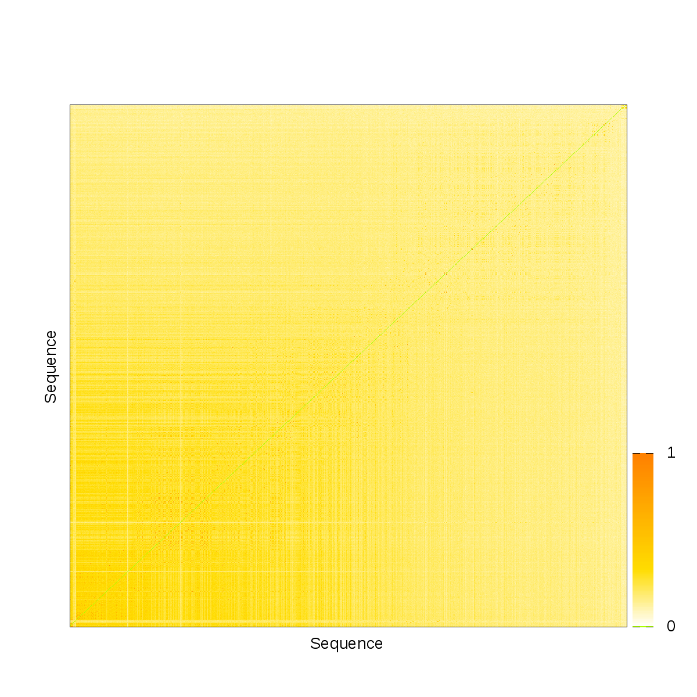
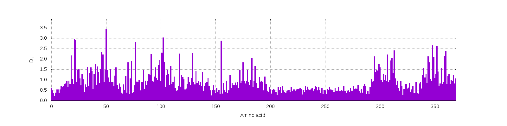

# Amino acid sequence

A multiple sequence alignment \(MSA\), as illustrated in Figure 1, is a sequence alignment of three or more biological sequences, generally protein, DNA, or RNA. Multiple sequence alignments can be useful in many circumstances, e.g., detecting historical and familial relations between sequences of proteins or amino acids and determining certain structures or locations on sequences.


### Statistics in sequences

In order to preprare protein sequences, one needs to install [HMMER software](http://hmmer.org/) and download UniRef database [here](https://www.uniprot.org/downloads). The MSA can be obtained from the HMMER web-server if you don't want to locally install the software suite. Before you start to launch Leri, a multiple sequence alignment \(MSA\) is required. Firstly, install software _jackhmmer_ on your own machine if there is no the tool. Here, _jackhmmer_ is used to prepare the MSA by search against the Uniref\*\* database. A simple script that illustrates how to apply the _jackhmmer_ to search your query protein sequence is show as follows,

```bash
$ jackhmmer \
  --notextwi \                                    # Unlimit ASCII text output line width
   -A <USER_DEFINED_FILE.sto> \                   # Save the multiple alignment of hits to file
  --tblout <USER_DEFINED_FILE_tbl.out> \          # Save parseable table of per-sequence hits to file
  --domtblout <USER_DEFINED_FILE_domtbl.out> \    # Save parseable table of per-domain hits to file
   -E 0.01 \                                      # Report sequences <= this E-value threshold in output
  --popen 0.25 \                                  # Gap open probability
  --pextend 0.4 \                                 # Gap extend probability
  --mxfile <DIRECT_TO_BLOSUM62.mat> \             # Read substitution score matrix from file
    <FASTA> \                                      # Query protein sequence
   <DIRECT_TO_Uniref*> \                          # Where to locate the Uniref50, Uniref90, or Uniref100 database
   >/dev/null
```

When you get the multiple alignment of hits from the jackhmmer, it is time to launch the Leri to convert the file to the standard FASTA format. The command line that converts \*.sto file to FASTA file is presented here,

```bash
$ leri sequence_converter -jobname <JOB_NAME> -msa <NAME_OF_STO>.sto
```





Trim aligned sequences according to the query sequence.

```bash
$ leri sequence_trim -jobname <JOB_NAME> -msa <NAME_OF_MSA>_msa.a2m
```

Basic statistics on the aligned sequences,

```bash
$ leri sequence_stats -jobname <JOB_NAME> -msa <NAME_OF_MSA>_msa_trimmed.aln
```


